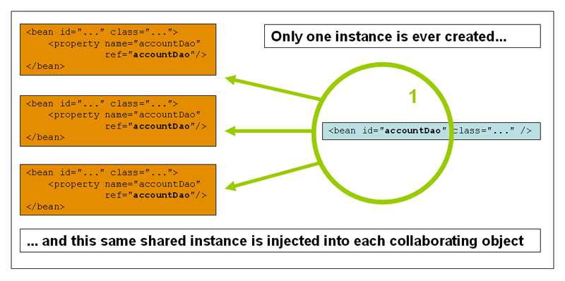
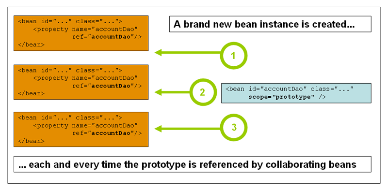

### 1.Spring Framework总览

#### 1.1 特性总览

核心特性：

- IoC容器(IoC Container)
- Spring事件(Events)
- 资源管理(Resources)
- 国际化(i18n)
- 校验(Validation)
- 数据绑定(Data Binding)
- 类型转换(Type Conversion)
- Spring表达式(Spring Express Language)
- 面向切面编程(AOP)

#### 1.2 面试题：Spring Framework有哪些核心模块？

- spring-core：Spring基础API模块，如资源管理，泛型处理；
- spring-beans：Spring Bean相关，如依赖查找、依赖注入；
- spring-aop：Spring AOP处理，如动态代理，AOP字节码提升；
- spring-context：事件驱动、注解驱动，模块驱动等；
- spring-expression：Spring表达式语言模块。

### 2.重新认识IoC

#### 2.1 IoC容器的职责

- 依赖处理

  - 依赖查找
  - 依赖注入

- 生命周期管理

  - 容器
  - 托管的资源(Java Beans或其他资源)

- 配置

  - 容器
  - 外部化配置
  - 托管的资源(Java Beans或其他资源)

#### 2.2 依赖查找VS依赖注入

| 类型     | 依赖处理 | 实现便利性 | 代码侵入性   | API依赖性     | 可读性 |
| -------- | -------- | ---------- | ------------ | ------------- | ------ |
| 依赖查找 | 主动获取 | 相对繁琐   | 侵入业务逻辑 | 依赖容器API   | 良好   |
| 依赖注入 | 被动提供 | 相对便利   | 低侵入性     | 不依赖容器API | 一般   |

#### 2.3 面试题：什么是Spring IoC容器？

IoC是反转控制，类似于好莱坞原则，主要有依赖查找和依赖注入实现。容器创建对象，将它们装配在一起，配置它们并管理它们的完整的生命周期，Spring容器使用依赖注入来管理组成应用程序的组件。

#### 2.4 面试题：依赖查找和依赖注入的区别？

依赖查找是主动或手动的依赖查找方式，通常需要依赖容器或标准API实现；而依赖注入则是手动或自动依赖绑定的方式，无需依赖特定的容器和API。

#### 2.5  面试题：Spring作为IoC容器有什么优势？

典型的IoC管理：依赖查找和依赖注入；AOP抽象；事务抽象；事件机制；SPI扩展；强大的第三方整合；易测试性；更好的面向对象。

### 3.IoC容器概述

#### 3.1 Spring IoC依赖查找

- 根据Bean名称查找
  - 实时查找
  - 延迟查找
- 根据Bean类型查找
  - 单个Bean对象
  - 集合Bean对象
- 根据Bean名称+类型查找
- 根据Java注解查找
  - 单个Bean对象
  - 集合Bean对象

#### 3.2 Spring IoC依赖注入

- 根据Bean名称注入
- 根据Bean类型注入
  - 单个Bean对象
  - 集合Bean对象
- 注入容器内建Bean对象
- 注入非Bean对象
- 注入类型
  - 实时注入
  - 延迟注入

#### 3.3 Spring IoC依赖来源

- 自定义Bean
- 容器内建Bean对象
- 容器内依赖

#### 3.4 Spring IoC配置元信息

- Bean定义配置
  - 基于XML文件
  - 基于Properties文件
  - 基于Java注解
  - 基于Java API
- IoC容器配置
  - 基于XML文件
  - 基于Java注解
  - 基于Java API
- 外部化属性配置
  - 基于Java注解

#### 3.5 Spring应用上下文

ApplicationContext除了IOC容器角色，还提供了：

- 面向切面(AOP)
- 配置元信息
- 资源管理
- 事件
- 国际化(i18n)
- 注解
- Environment抽象

BeanFactory是Spring底层IoC容器；ApplicationContext是具备应用特性的BeanFactory超集。

#### 3.6 面试题：BeanFactory与FactoryBean的区别？

BeanFactory是IoC底层容器；FactoryBean是创建Bean的一种方式，帮助实现复杂的初始化逻辑。

#### 3.7 面试题：Spring IoC容器启动时做了哪些准备？

IoC配置元信息读取和解析(XML、Bean的注解)、IoC容器生命周期、Spring事件发布、国际化等。

### 4.Spring Bean基础

#### 4.1 定义Spring Bean

- 什么是BeanDefinition?

  BeanDefinition是SpringFramework中定义Bean的配置元信息接口，包括：

  - Bean的类名

  - Bean行为配置元素，如作用域、自动绑定的模式，生命周期回调等
  - 其他Bean引用，又可称作合作者或者依赖
  - 配置设置，比如Bean属性(Properties)

- BeanDefinition元信息

  | 属性(Property)           | 说明                                         |
  | ------------------------ | -------------------------------------------- |
  | Class                    | Bean全类名，必须是具体类，不能用抽象类或接口 |
  | Name                     | Bean的名称或者ID                             |
  | Scope                    | Bean的作用域(如：singleton、prototype)       |
  | Constructor arguments    | Bean构造器参数(用于依赖注入)                 |
  | Properties               | Bean属性设置(用于依赖注入)                   |
  | Autowiring mode          | Bean自动绑定模式(如：通过名称byName)         |
  | Lazy initialization mode | Bean延迟初始化模式(延迟和非延迟)             |
  | Initialization method    | Bean初始化回调方法名称                       |
  | Destruction method       | Bean销毁回调方法名称                         |


#### 4.2 命名Spring Bean

- Bean的名称

  每个Bean拥有一个或多个标识符(identifiers)，这些标识符在Bean所在的容器必须是唯一的。通常，一个Bean仅有一个标识符，如果需要额外的，可通过别名(Alias)来扩展。

  在基于XML的配置元信息中，开发人员可用id或者name属性来规定Bean的标识符，通常Bean的标识符由字母组成，允许出现特殊字符。如果要想引入Bean的别名的话，可在name属性使用","或";"来间隔。

  Bean的id或name属性并非必须定制，如果留空的话，容器会为Bean自动生成一个唯一的名称。

- Spring Bean的别名

  - 复用现有的BeanDefinition

  - 更具有场景化的命名方法，比如：

    ```xml
    <alias name="myApp-dataSource" alias="subsystemA-dataSource"/>
    <alias name="myApp-dataSource" alias="subsystemB-dataSource"/>
    ```


#### 4.3 注册Spring Bean

- BeanDefintion注册

  - XML配置元信息

    <bean name="..." .../>

  - Java注解配置元信息

    - @Bean
    - @Component
    - @Import

  - Java API配置元信息

    - 命名方式：BeanDefinitionRegistry#registerBeanDefinition(String beanName, BeanDefinition beanDefinition)
  - 非命名方式：BeanDefinitionReaderUtils#registerWithGeneratedName(AbstractBeanDefinition definition, BeanDefinitionRegistry registry)
    - 配置类方式：AnnotatedBeanDefinitionReader#register(Class...)

  - 外部单例对象注册
  
    - Java API配置元信息
  
      SingletonBeanRegistry#registerSingleton(String beanName, Object singletonObject)

#### 4.4 实例化Spring Bean

- Bean实例化(Instantiation)
  - 常规方式
    - 通过构造器(配置元信息：XML、Java注解和Java API)
    - 通过静态工厂(配置元信息：XML和Java API)
    - 通过Bean工厂方法(配置元信息：XML和Java API)
    - 通过FactoryBean(配置元信息：XML、Java注解和Java API)
  - 特殊方式
    - 通过ServiceLoaderFactoryBean(配置元信息：XML、Java注解和Java API)
    - 通过AutowireCapableBeanFactory#createBean(Class<?> beanClass, int autowireMode, boolean dependencyCheck) 
    - 通过BeanDefinitionRegistry#registerBeanDefinition(String beanName, BeanDefinition beanDefinition)

#### 4.5 初始化Spring Bean

- @PostConstruct标注方法
- 实现InitializingBean接口的afterPropertiesSet()方法
- 自定义初始化方法
  - XML配置：<bean init-metod="init" .../>
  - Java注解：@Bean(initMethod="init")
  - Java API：AbstractBeanDefinition#setInitMetodName(String initMethodName)

**加载顺序：构造方法->@Autowired/@Value->@PostConstruct->实现InitializingBean接口的afterPropertiesSet()方法->@Bean(initMethod="")**

**延迟初始化Spring Bean**

- Bean 延迟初始化(Lazy Initialization)
  - XML配置：<bean lazy-init="true" .../>
  - Java注解：@Lazy(true)

#### 4.6 销毁Spring Bean

- Bean销毁(Destroy)
  - @PreDestroy标注方法
  - 实现DispocableBean的destroy()方法
  - 自定义销毁方法
    - XML配置：<bean destroy="destroy".../>
    - Java注解：@Bean(destroy="destroy")
    - Java API：AbstractBeanDefinition#setDestroyMethodName(String initMethodName)
- 垃圾回收Spring Bean(GC)
  1. 关闭Spring容器(应用上下文)
  2. 执行GC
  3. Spring Bean覆盖的finalize()方法被回调

#### 4.7 面试题：如何注册一个Spring Bean

通过BeanDefinition和外部单体对象来注册。

#### 4.8 面试题：什么是Spring BeanDefinition

BeanDefinition是SpringFramework中定义Bean的配置元信息接口，包括：

- Bean的类名
- Bean行为配置元素，如作用域、自动绑定的模式，生命周期回调等
- 其他Bean引用，又可称作合作者或者依赖
- 配置设置，比如Bean属性(Properties)

> 回顾"定义Spring Bean"和"BeanDefinition元信息"

### 5.依赖查找

#### 5.1 单一类型依赖查找

BeanFactory

- 根据Bean名称查找
  - getBean(String name)
  - Spring 2.5 覆盖默认参数：getBean(String name, Object... args)
- 根据Bean类型查找
  - Bean实时查找
    - Spring 3.0 getBean(Class<T> requiredType)
    - Spring 4.1 覆盖默认参数：getBean(Class<T> requiredType, Object... args)
  - Spring 5.1 Bean延迟查找
    - getBeanProvider(Class<T> requiredType)
    - getBeanProvider(ResolvableType requiredType);
  - 根据Bean名称+类型查找：getBean(String name, Class<T> requiredType)

#### 5.2 集合类型依赖查找

ListableBeanFactory

- 根据Bean类型查找

  - 获取同类型Bean名称列表

    - getBeanNamesForType(Class<?> type)
    - Spring 4.2 getBeanNamesForType(ResolvableType type)

  - 获取同类型Bean实例列表

    - getBeansOfType(Class<T> type)以及重载方法

  - 通过注解类型查找

    - Spring 3.0 获取标注类型Bean名称列表：getBeanNamesForAnnotation(Class<? extends Annotation> annotationType)

    - Spring 3.0 获取标注类型Bean实例列表：getBeansWithAnnotation(Class<? extends Annotation> annotationType)

    - Spring 3.0 获取指定名称+标注类型Bean实例：findAnnotationOnBean(String beanName, Class<A> annotationType)

#### 5.3 层次性依赖查找

- HierarchicalBeanFactory
  - 双亲BeanFactory：getParentBeanFactory()
  - 层次性查找
    - 根据Bean名称查找：基于containsLocalBean方法实现
    - 根据Bean类型查找实例列表：
      1. 单一类型：BeanFactoryUtils#beanOfType
      2. 集合类型：BeanFactoryUtils#beansOfTypeIncludingAncestors
    - 根据Java注解查找名称列表：BeanFactoryUtils#beanNamesForTypeIncludingAncestors

#### 5.4 Bean延迟依赖查找

- ObjectFactory
- ObjectProvider
  - Spring 5对Java 8特性扩展
    - 函数式接口
      - getIfAvailable(Supplier)
      - ifAvailable(Consumer)
    - Stream扩展-stream()

#### 5.5 安全依赖查找

| 依赖查找类型 | 代表实现                           | 是否安全 |
| ------------ | ---------------------------------- | -------- |
| 单一类型查找 | BeanFactory#getBean                | 否       |
|              | ObjectFactory#getObject            | 否       |
|              | ObjectProvider#getIfAvailable      | 是       |
|              |                                    |          |
| 集合类型查找 | ListableBeanFactory#getBeansOfType | 是       |
|              | ObjectProvider#stream              | 是       |

> 层次性依赖查找的安全性取决于其扩展的单一或集合类型的BeanFactory接口
>
> 1. HierarchicalBeanFactory extends `BeanFactory`    不安全
> 2.  ConfigurableListableBeanFactory
>          extends `ListableBeanFactory`, AutowireCapableBeanFactory, ConfigurableBeanFactory    安全

#### 5.6 内建可查找的依赖

- AbstractApplicationContext 内建可查找的依赖

  | Bean名称                    | Bean实例                        | 使用场景               |
  | --------------------------- | ------------------------------- | ---------------------- |
  | environment                 | Environment对象                 | 外部化配置以及Profiles |
  | systemProperties            | java.util.Properties对象        | Java系统属性           |
  | systemEnvironment           | java.util.Map对象               | 操作系统环境变量       |
  | messageSource               | MessageSource对象               | 国际化文案             |
  | lifecycleProcessor          | LifecycleProcessor对象          | Lifecycle Bean处理器   |
  | applicationEventMulticaster | ApplicationEventMulticaster对象 | Spring事件广播器       |

- 注解驱动Spring应用上下文内建可查找的依赖

  | Bean名称                                                     | Bean实例                                                     | 使用场景                                            |
  | ------------------------------------------------------------ | ------------------------------------------------------------ | --------------------------------------------------- |
  | org.springframework.context.annotation.internalConfigurationAnnotationProcessor | ConfigurationClassPostProcessor对象(Bean的后置处理，BeanFactory生命周期) | 处理Spring配置类                                    |
  | org.springframework.context.annotation.internalAutowiredAnnotationProcessor | AutowiredAnnotationBeanPostProcessor对象(Bean的后置处理，Bean生命周期) | 处理@Autowired以及@Value注解                        |
  | org.springframework.context.annotation.internalCommonAnnotationProcessor | CommonAnnotationBeanPostProcessor对象(Bean的后置处理，需要条件激活) | (条件激活)处理JSR-250注解，如@PostConstruct等       |
  | org.springframework.context.event.internalEventListenerProcessor | EventListenerMethodProcessor对象                             | 处理标注@EventListener的Spring事件监听方法          |
  | org.springframework.context.event.internalEventListenerFactory | DefaultEventListenerFactory对象                              | @EventListener事件监听方法适配为ApplicationListener |
  | org.springframework.context.annotation.internalPersistenceAnnotationProcessor | PersistenceAnnotationBeanPostProcessor对象(Bean的后置处理，需要条件激活) | (条件激活)处理JPA注解场景                           |


#### 5.7 依赖查找中的经典异常

- BeansException子类型

  | 异常类型                        | 触发条件(举例)                            | 场景举例                                    |
  | ------------------------------- | ----------------------------------------- | ------------------------------------------- |
  | NoSuchBeanDefinitionException   | 当查找Bean不存在IoC容器时                 | BeanFactory#getBean ObjectFactory#getObject |
  | NoUniqueBeanDefinitionException | 类型依赖查找的时，IoC容器存在多个Bean实例 | BeanFectory#getBean(Class)                  |
  | BeanInstantiationException      | 当Bean所对应的类型非具体类时              | BeanFactory#getBean                         |
  | BeanCreationException           | 当Bean初始化过程中                        | Bean初始化方法执行异常时                    |
  | BeanDefinitionStoreException    | 当BeanDefinition配置元信息非法时          | XML配置资源无法打开时                       |


#### 5.8 面试题：ObjectFactory与BeanFactory的区别？

ObjectFactory与BeanFactory均提供依赖查找的能力。不过ObjectFactory仅关注一个或一种类型的Bean依赖查找，并且自身不具备依赖查找的能力，能力则由BeanFactory输出。

BeanFactory则提供了单一类型、集合类型以及层次性等多种依赖查找方式。

#### 5.9 面试题：BeanFactory#getBean操作是否线程安全？

BeanFactory#getBean方法的执行是线程安全的，操作过程中会增加互斥锁。

#### 5.10 面试题：Spring依赖查找与注入在来源上的区别？

### 6.Spring IoC注入

#### 6.1 依赖注入的模式和类型

**依赖注入模式**

- 手动模型-配置或编程的方式，提前安排注入规则

  - XML资源配置元信息
  - Java注解配置元信息
  - API配置元信息

- 自动模式-实现方提供依赖自动关联的方式，按照内建的注入规则

  - Autowiring(自动绑定)

**依赖注入类型**

| 依赖注入类型 | 配置元数据举例                                  |
| ------------ | ----------------------------------------------- |
| Setter方法   | < property name="user" ref="userBean"/ >        |
| 构造器       | < constructor-arg name="user" ref="userBean" /> |
| 字段         | @Autowired User user;                           |
| 方法         | @Autowired public void user(User user){...}     |
| 接口回调     | class MyBean implements BeanFactoryAware{...}   |

#### 6.2 自动绑定(Autowiring)

- Autowiring modes 自动绑定模式

  | 模式      | 说明                                                         |
  | --------- | ------------------------------------------------------------ |
  | no        | 默认值，未激活Autowiring，需要手动指定依赖注入对象           |
  | byName    | 根据被注入属性的名称作为Bean名称进行依赖查找，并将对象设置到该属性 |
  | byType    | 根据被注入属性的类型作为依赖类型进行查找，并将对象设置到该属性 |
  | construct | 特殊byType类型，用于构造器参数                               |

- Autowiring的不足

  1. `property`和`constructor-arg`设置会覆盖autowiring；不能绑定简单的类型，包括原生类型、String类型和Class类型。
  2. autowiring不如显式装配精确。
  3. autowiring信息无法产生文档、帮助等。
  4. 如果应用上下文存在多个相同类型Bean，对于期望单个值的依赖项，则抛出异常。

#### 6.3 Setter方法注入

- 实现方法
  - 手动模式
    - XML资源配置元信息
    - Java注解配置元信息
    - API配置元信息
  - 自动模式
    - byName
    - byType

#### 6.4 构造器注入

- 实现方法
  - 手动模式
    - XML资源配置元信息
    - Java注解配置元信息
    - API配置元信息
  - 自动模式
    - constructor

#### 6.5 字段注入

- 实现方法
  - 手动模式
    - Java注解配置元信息：@Autowired	@Resource	@Inject

  


#### 6.6 方法注入

- 实现方法
  - 手动模式
    - Java注解配置元信息：@Autowired	@Resource	@Inject	@Bean

#### 6.7 接口回调注入

| 内建接口                       | 说明                                                 |
| ------------------------------ | ---------------------------------------------------- |
| BeanFactoryAware               | 获取IoC容器-BeanFactory                              |
| ApplicationContextAware        | 获取Spring应用上下文-ApplicationContext对象          |
| EnvironmentAware               | 获取Environment对象                                  |
| ResourceLoaderAware            | 获取资源加载器对象-ResourceLoader                    |
| BeanClassLoaderAware           | 获取加载当前Bean Class的ClassLoader                  |
| BeanNameAware                  | 获取当前Bean的名称                                   |
| MessageSourceAware             | 获取MeassageSource对象，用于Spring国际化             |
| ApplicationEventPublisherAware | 获取ApplicationEventPublishAware对象，用于Spring事件 |
| EmbeddedValueResolverAware     | 获取StringValueResolver对象，用于占位符处理          |

#### 6.8 依赖注入类型选择

- 低依赖：构造器注入(保证依赖不可变、不为null；构造器的参数过多时，构造过程变得复杂)
- 多依赖：Setter方法注入(注入的时机、先后顺序完全依赖用户操作)
- 便利性：字段注入(@Autowired)
- 声明类：方法注入

#### 6.9 基础类型注入&集合类型注入

- 基础类型
  - 原生类型(Primitive)：boolean、byte、char、short、int、float、long、double
  - 标量类型(Scalar)：Number、Charcater、Boolean、Enum、Locale、Charset、Currency
  - 常规类型(General)：Object、String、TimeZone、Calendar、Optional等
  - Spring类型：Resource、InputSource、Formatter等
- 集合类型
  - 数组类型(Array)：原生类型、标量类型、常规类型、Spring类型
  - 集合类型(Collection)：
    - Collection：List、Set(SortedSet、NavigableSet、EnumSet)
    - Map：Properties

#### 6.10 限定注入

- 使用注解@Qualifier限定
  - 通过Bean名称限定
  - 通过分组限定
- 基于注解@Qualifier扩展限定
  - 自定义注解-如Spring Cloud @LoadBalanced

#### 6.11 延迟依赖注入

- ObjectFactory 延迟注入
  - 单一类型 (不安全)
  - 集合类型
- ObjectProvider 延迟注入(推荐)
  - 单一类型
  - 集合类型

#### 6.12 依赖处理过程

- 入口：DefaultListableBeanFactory#resolveDependency
- 依赖描述符：DependencyDescriptor
- 自动绑定候选对象处理器：AutowireCandidateResolver

#### 6.13 @Autowired注入与@Inject注入

@Autowired注入过程：

- 元信息解析
- 依赖查找
- 依赖注入(字段、方法)

@Inject注入过程

- 如果JSR-330存在于ClassPath中，复用AutowiredAnnotationBeanPostProcessor实现

#### 6.14 Java通用注解注入原理

- 注入注解
  - javax.xml.ws.WebServiceRef
  - javax.ejb.EJB
  - javax.annotation.Resources
- 生命周期注解
  - javax.annotation.PostConstruct
  - javax.annotation.PreDestrory

#### 6.15 自定义依赖注入注解

- 基于AutowiredAnnotationBeanPostProcessor实现
- 自定义实现
  - 生命周期处理
    - InstantiationAwareBeanPostProcessor
    - MergedBeanDefinitionPostProcessor
  - 元数据
    - InjectedElement
    - InjectionMetadata

#### 6.16 面试题：有多少种依赖注入的方式？

- 构造器注入(少依赖，强制依赖)
- Setter注入(多依赖，非强制依赖)
- 字段注入(开发便利)
- 方法注入(声明)
- 接口回调注入(生命周期回调注入)

#### 6.17 面试题：偏好构造器注入还是Setter注入？

两种依赖注入均可使用，如果是必须依赖的话，推荐使用构造器注入，Setter注入用于可选依赖。

#### 6.18 面试题：Spring依赖注入的来源有哪些？

### 7.Spring IoC依赖来源

#### 7.1 依赖查找的来源

- 查找来源

  | 来源                  | 配置元数据                            |
  | --------------------- | ------------------------------------- |
  | Spring BeanDefinition | < bean id="user" class="org...User" > |
  |                       | @Bean public User user() {...}        |
  |                       | BeanDefinitionBuilder                 |
  | 单例对象              | API实现                               |

- Spring内建BeanDefinition

  | Bean名称                                                     | Bean实例                                 | 使用场景                                    |
  | ------------------------------------------------------------ | ---------------------------------------- | ------------------------------------------- |
  | org.springframework.context.annotation.internalConfigurationAnnotationProcessor | ConfigurationClassPostProcessor对象      | 处理Spring配置类                            |
  | org.springframework.context.annotation.internalAutowiredAnnotationProcessor | AutowiredAnnotationBeanPostProcessor对象 | 处理@Autowire以及@Value注解                 |
  | org.springframework.context.annotation.internalCommonAnnotationBeanPostProcessor | CommonAnnotationBeanPostProcessor对象    | (条件激活)处理JSR-250注解，如@PostConstruct |
  | org.springframework.context.event.internalEventListenerProcessor | EventListenerMethodProcessor对象         | 处理标注@EventListener的Spring事件监听方法  |

- Spring内建单例对象

  | Bean名称                    | Bean实例                        | 使用场景               |
  | --------------------------- | ------------------------------- | ---------------------- |
  | environment                 | Environmen对象                  | 外部化配置以及Profiles |
  | systemProperties            | java.util.Properties            | Java系统属性           |
  | systemEnvironment           | java.util.Map对象               | 操作系统环境变量       |
  | messageSource               | MessageSource对象               | 国际化文案             |
  | lifecycleProcessor          | LifecycleProcessor对象          | Lifecycle Bean处理器   |
  | applicationEventMulticaster | ApplicationEventMulticaster对象 | Spring事件广播器       |


#### 7.2 依赖注入的来源

- 注入来源

  | 来源                  | 配置元数据                            |
  | --------------------- | ------------------------------------- |
  | Spring BeanDefinition | < bean id="user" class="org...User" > |
  |                       | @Bean public User user() {...}        |
  |                       | BeanDefinitionBuilder                 |
  | 单例对象              | API实现                               |
  | 非Spring容器管理对象  |                                       |

#### 7.3 Spring容器管理和游离对象

| 来源                  | Spring Bean对象 | 生命周期管理 | 配置元信息 | 使用场景           |
| --------------------- | --------------- | ------------ | ---------- | ------------------ |
| Spring BeanDefinition | 是              | 是           | 有         | 依赖查找、依赖注入 |
| 单例对象              | 是              | 否           | 无         | 依赖查找、依赖注入 |
| ResolveableDependency | 否              | 否           | 无         | 依赖注入           |

- Spring BeanDefinition作为依赖来源

  - 要素

    - 元数据：BeanDefinition

    - 注册：BeanDefinitionRegistry#registerBeanDefinition

    - 类型：延迟和非延迟

    - 顺序：Bean生命周期顺序按照注册顺序
- 单例对象作为依赖来源

  - 要素

    - 来源：外部普通Java对象(不一定是POJO)

    - 注册：SingletonBeanRegistry#registerSingleton

  - 限制

    - 无生命周期管理

    - 无法实现延迟初始化Bean
- 非Spring容器管理对象作为依赖来源

  - 要素
    - 注册：ConfigurableListableBeanFactory#registerResolvableDependency
  - 限制
    - 无生命周期管理
    - 无法实现延迟初始化Bean
    - 无法通过依赖查找
- 外部化配置作为依赖来源
  - 要素
    - 类型：非常规Spring对象依赖来源
  - 限制
    - 无生命周期管理
    - 无法实现延迟初始化Bean
    - 无法通过依赖查找

#### 7.4 面试题：注入和查找的依赖来源是否相同？

否，依赖查找的来源仅限于Spring BeanDefinition以及单例对象；而依赖注入的来源还包括Resolvable Dependency以及@Value所标注的外部化配置。

#### 7.5 面试题：单例对象能否在IoC容器启动后注册？

可以，单例对象的注册与BeanDefinition不同，BeanDefinition会被ConfigurableListableBeanFactory#freezeConfiguration()方法影响，从而冻结注册，单例对象则没这个限制。

#### 7.6 面试题：Spring 依赖注入的来源有哪些

Spring BeanDefinition；单例对象；Resolvable Dependency(ConfigurationListableBeanFactory)；@Value外部化配置(AutowiredAnnotationBeanPostProcessor)

### 8.Spring Bean作用域

- 作用域

  | 来源        | 说明                                                         |
  | ----------- | ------------------------------------------------------------ |
  | singleton   | 默认Spring Bean作用域，一个Bean Factory有且仅有一个实例(单例模式) |
  | prototype   | 原型作用域，每次依赖查找和依赖注入生成新Bean对象(原型模式)   |
  | request     | 将Spring Bean存储在ServletRequest上下文中                    |
  | session     | 将Spring Bean存储在HttpSession中                             |
  | application | 将Spring Bean存储在ServletContext中                          |

#### 8.1 "singleton" Bean作用域



### 8.2 "prototype" Bean作用域



- 注意：Spring容器无法管理prototype Bean的完整生命周期，也无法记录实例的存在。销毁回调方法将不会执行，可以利用BeanPostProcessor进行清扫工作。

### 8.3 "request" Bean作用域

- 配置
  - XML：< bean class="..." scope="request" />
  - Java注解：@RequestScope或@Scope(WebApplicationContext.SCOPE_REQUEST)
- 实现
  - API：RequestScope

### 8.4 "session" Bean作用域

- 配置
  - XML：< bean class="..." scope="session" />
  - Java注解：@SessionScope或@Scope(WebApplicationContext.SCOPE_SESSION)
- 实现
  - API：SessionScope

### 8.5 "application" Bean作用域

- 配置
  - XML：< bean class="..." scope="application" />
  - Java注解：@AppliactionScope或@Scope(WebApplicationContext.SCOPE_APPLICATION)
- 实现
  - API：ServletContextScope

### 8.6 自定义Bean作用域

1. 实现Scope

   org.springframework.beans.factory.config.Scope

2. 注册Scope

   - org.springframework.beans.factory.config.ConfigurableBeanFactory#registerScope

   - 配置

     ```xml
     	<bean class="org.springframework.beans.factory.config.CustomScopeConfigurer">
             <property name="scopes">
                 <map>
                     <entry key="...">
                         
                     </entry>
                 </map>
             </property>
         </bean>
     ```


### 8.7 面试题：Spring内建的Bean作用域有几种？

singleton、prototype、request、session、application以及webSocket。

### 8.8 面试题：singleton Bean是否在一个应用是唯一的？

否，singleton bean仅在当前Spring IoC容器(BeanFactory)中是单例对象。

### 8.9 面试题：application Bean是否可以被其它方案代替？

可以，实际上application Bean与singleton Bean没有本质区别。

## 9.Spring Bean生命周期

### 9.1 Spring Bean元信息配置阶段

BeanDefinition配置

- 面向资源
  - XML配置
  - Properties资源配置
- 面向注解
- 面向API

### 9.2 Spring Bean元信息解析阶段

BeanDefinition解析

- 面向资源BeanDefinition解析
  - BeanDefinitionReader
  - XML解析器 - BeanDefinitionParser
- 面向注解BeanDefinition解析
  - AnnotatedBeanDefinitionReader

### 9.3 Spring Bean注册阶段

BeanDefinitionRegistry注册接口

- BeanDefinitionRegistry

### 9.4 Spring BeanDefinition合并阶段

BeanDefinition合并

- 父子BeanDefinition合并
  - 当前BeanFactory查找
  - 层次性BeanFactory查找

### 9.5 Spring Bean Class加载阶段

- ClassLoader类加载
- Java Security安全控制
- ConfigurableBeanFactory临时ClassLoader

### 9.6 Spring Bean实例化阶段

**非主流生命周期 - 实例化前阶段：**

- InstantiationAwareBeanPostProcessor#postProcessBeforeInstantiation

**实例化阶段：**

- 传统实例化方式：InstantiationStrategy
- 构造器依赖注入

**实例化后阶段：**

- Bean属性赋值(Populate)判断
  - InsantiationAwareBeanPostProcessor#postProcessAfterInstantiantion

### 9.7 Spring Bean属性赋值前阶段

Bean属性值元信息

- PropertyValues

Bean属性赋值前回调

- Spring 1.2-5.0：InstantiationAwareBeanPostProcessor#postProcessPropertyValues
- Spring 5.1：InstantiationAwareBeanProcessProperties#postProcessProperties

### 9.8 Spring Bean Aware接口回调阶段

Spring Aware接口

- BeanNameAware
- BeanClassLoaderAware
- BeanFactoryAware

在applicationContext下才会回调

- EnvironmentAware
- EmbeddedValueResolverAware
- ResourceLoaderAware
- ApplicationEventPublishAware
- MessageSourceAware
- ApplicationContextAware

### 9.9 Spring Bean初始化前阶段

已完成：

- Bean实例化
- Bean属性赋值
- Bean Aware接口回调

方法回调：

- BeanPostProcessor#postProcessBeforeInitialization

### 9.10 Spring Bean初始化阶段

Bean初始化(Initialization)

- @PostConstruct标注方法
- 实现InitializingBean接口的afterPropertiesSet()方法
- 自定义初始化方法

### 9.11 Spring Bean初始化后阶段

方法回调

- BeanPostProcessor#postProcessAfterInitialization

### 9.12 Spring Bean初始化完成阶段

方法回调

- Spring 4.1+：SmartInitializingSingleton#afterSingletonsInstantiated

### 9.13 Spring Bean销毁前阶段

方法回调

- DestructionAwareBeanPostProcessor#postProsessBeforeDestruction


